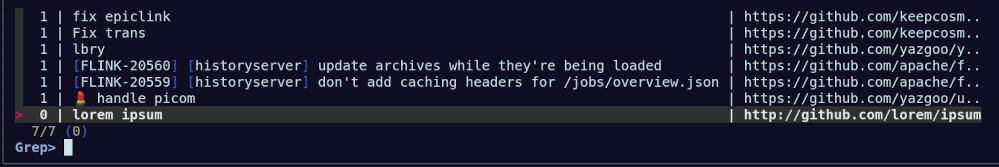
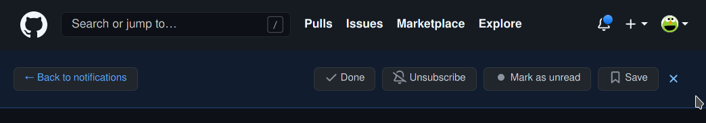

List (and open in your browser) github notifications and PRs

Supports multiple github accounts, can be used with rofi, fzf, vim (with fzf).



## prerequisites 

you need ruby and bundler installed.

## Configuration

In `~/.config/gh-notif-tui.json`, define your credentials.

- `user` command to retrieve the name of the github user to filter PRs
- `password` command to retrieve a [github personal access token](https://docs.github.com/en/github/authenticating-to-github/keeping-your-account-and-data-secure/creating-a-personal-access-token)
- `notes` command to retrieve the final id in `notification_referrer_id` (useful to have the notification shelf). See section `Getting final_id`
- `command` command to open an url (where `%` will be replaced by the URL.

```json
{
"creds": [
 {
 "user": "lpass show --user gh-notif-tui",
 "password": "lpass show --password gh-notif-tui",
 "notes": "lpass show --notes gh-notif-tui",
 "command": "firefox 'ext+container:name=Professionnel&url=%'"
 },
 {
 "user": "lpass show --user gh-notif-tui-perso",
 "password": "lpass show --password gh-notif-tui-perso",
 "notes": "lpass show --notes gh-notif-tui-perso",
 "command": "firefox 'ext+container:name=Personnel&url=%'"
 }
 ]
}
```

## Using it out of vim

It is also possible to run it directly within a terminal:

- PRs: `./gh-notif-tui.rb fzf prs`
- notifications `./gh-notif-tui.rb fzf notif`

Or directly with rofi:

- PRs: `./gh-notif-tui.rb rofi prs`
- notifications `./gh-notif-tui.rb rofi notif`

## Plugin install (vim)

First install fzf and this plugin

```vim
Plug 'junegunn/fzf', { 'dir': '~/.fzf', 'do': './install --all' }
Plug 'yazgoo/gh-notif-tui', {'do': 'bundle config set --local path .vendor/bundle && bundle install'}
```

in your vimrc:

```vim
nnoremap <space>n :GhNotif<cr>
nnoremap <space>i :GhNotifPrs<cr>
```

## Getting `final_id`

`final_id` will allow to have the notification shelf when opening your notifications, which looks like this:



- Go to notification page `https://github.com/notifications?query=is%3Aunread`
- Get an URL from the notification list (e.g. `https://github.com/mixer/retrieval/pull/4?notification_referrer_id=MDE4Ok5vdGlmaWNhdGlvblRocmVhZDEzNTk4ODE4MzA6MjIzMDk4NQ%3D%3D`).
- Extract the `notification_referrer_id` parameter from the URL, replacing `%3D` with `=` (e.g. `MDE4Ok5vdGlmaWNhdGlvblRocmVhZDEzNTk4ODE4MzA6MjIzMDk4NQ==`)
. decode the `notification_referrer_id` (e.g. echo "MDE4Ok5vdGlmaWNhdGlvblRocmVhZDEzNTk4ODE4MzA6MjIzMDk4NQ==" | base64 -d)
- extract the `final_id` from the decoded string (e.g. `018:NotificationThread1359881830:2230985` => `2230985`)
